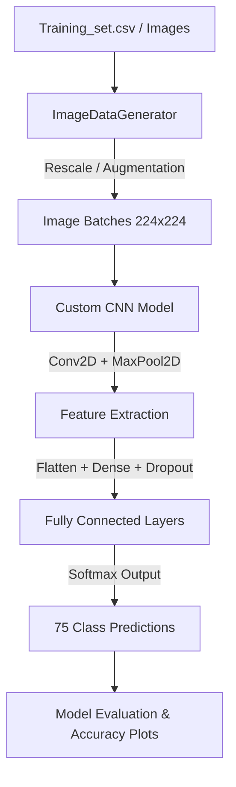

# 🦋 Butterfly Species Classification using CNN

[](https://www.python.org/)
[](https://www.tensorflow.org/)
[](https://keras.io/)
[]()

A deep learning project implementing a custom Convolutional Neural Network (CNN) in TensorFlow/Keras to classify images of different butterfly species.

---

## 📊 Dataset Overview

The dataset contains labeled images of butterflies representing diverse species:
* **Total Training Images:** 6,499 images
* **Unique Species (Classes):** 75 classes (e.g., *Mourning Cloak*, *Sleepy Orange*, *Atala*, *Brown Siproeta*, etc.)
* **Class Distribution:** Ranging between 71 to 131 samples per class (relatively balanced)

> [!NOTE]
> Due to GitHub size limits, the raw images (`train/`, `test/`) and datasets (`Training_set.csv`, `Testing_set.csv`) are excluded from this repository.

---

## ⚙️ Pipeline Flowchart

This diagram represents the end-to-end data processing, model training, and evaluation pipeline of the project:



---

## 🧠 Model Architecture

The model is built using Keras' `Sequential` API with a custom convolutional layout tailored for fine-grained image classification:

| Layer (type) | Output Shape | Details |
| :--- | :--- | :--- |
| **Conv2D** | (None, 224, 224, 32) | 32 filters, 3x3 kernel, ReLU |
| **MaxPooling2D** | (None, 112, 112, 32) | 2x2 pool size |
| **Conv2D** | (None, 112, 112, 64) | 64 filters, 3x3 kernel, ReLU |
| **MaxPooling2D** | (None, 56, 56, 64) | 2x2 pool size |
| **Conv2D** | (None, 56, 56, 128) | 128 filters, 3x3 kernel, ReLU |
| **MaxPooling2D** | (None, 28, 28, 128) | 2x2 pool size |
| **Flatten** | (None, 100352) | Flattens feature maps |
| **Dense** | (None, 512) | 512 hidden nodes, ReLU |
| **Dropout** | (None, 512) | 50% dropout rate |
| **Dense (Output)** | (None, 75) | 75 output units (Softmax) |

---

## 📈 Training Performance

* **Optimizer:** Adam
* **Loss Function:** Categorical Crossentropy
* **Epochs:** 40
* **Accuracy Achievements:**
  * The custom model reaches **~73% validation accuracy** at the end of the 40 epochs.
  * Train and validation loss curve show stable convergence throughout the training session.

---

## 🛠️ Setup & Usage

### 1. Requirements
Ensure you have Python 3.10+ and the required packages installed:
```bash
pip install tensorflow numpy pandas matplotlib scikit-learn
```

### 2. Dataset Setup
To run the notebook locally, place your dataset folders (`train/`, `test/`) and CSV files (`Training_set.csv`, `Testing_set.csv`) in the same directory as the notebook.

### 3. Run the Project
Open the Jupyter Notebook and execute the cells:
```bash
jupyter notebook butterfly-species-classification-simple-cnn.ipynb
```
